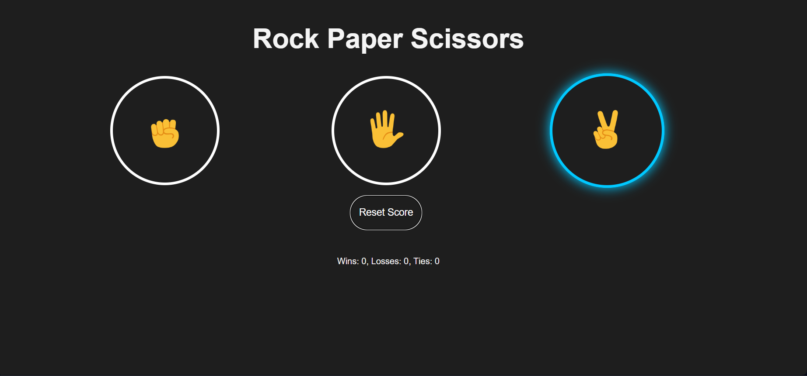
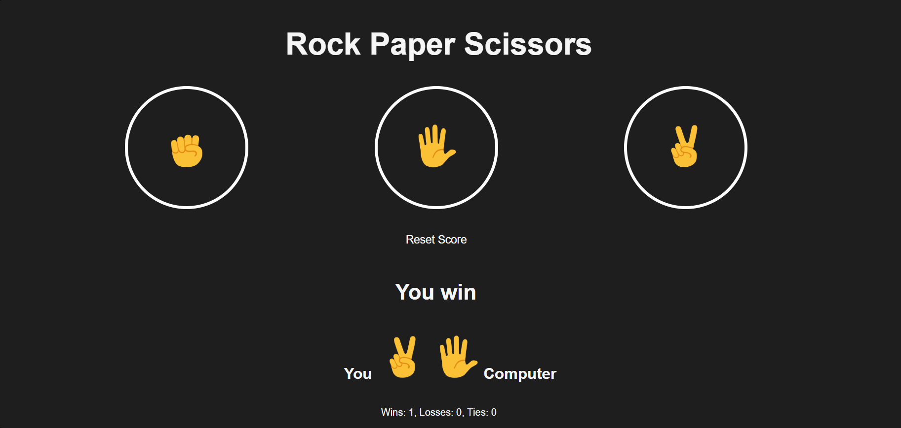

# Rock Paper Scissors Game 

A simple Rock Paper Scissors game built using HTML, CSS, and JavaScript.

This project was created while following a JavaScript full course tutorial and extended with custom UI adjustments, layout improvements, and hover effects.

---

## Features

- Random computer move generation
- Score tracking (Wins / Losses / Ties)
- Score persistence using localStorage
- Reset button functionality
- Hover effects on buttons
- Clean project structure with separated JavaScript file

---

## Technologies Used

- HTML5
- CSS3
- JavaScript (DOM Manipulation & localStorage)

---

## How It Works

The player selects Rock, Paper, or Scissors.
The computer randomly generates a move using `Math.random()`.
The result is calculated and displayed on the screen.

Scores are stored using `localStorage`, so they remain saved even after refreshing the page.

---

##  Preview

---

##  How to Run

1. Clone or download the repository  
2. Open  `index.html` in your browser  

---

##  Acknowledgment

Inspired by a JavaScript Full Course tutorial. The layout, styling, and UI behavior were customized independently.

---

Created as a practice project to improve JavaScript fundamentals, DOM manipulation, and state management skills.
## Live Demo
https://elif-tasdelen.github.io/Rock-paper-scissors-game/